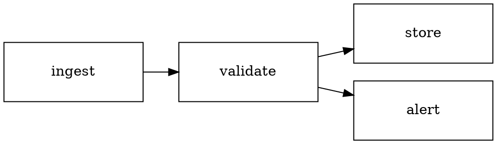

# Diagram layouts — proven shapes

Each was built, validated (DL-*), and render-reviewed on a real machine
before being written here. The library is style-only; positions come from
`scripts/drawio_layout.py` (graphviz `dot`) or a hand grid. Import:

```python
import sys, json, subprocess
sys.path.insert(0, "<plugin>/scripts")
import drawio_lib as dl
```

Nodes are **typed** — `node(cid, label, x, y, w=136, h=56, kind="action", note=None)`.
`kind` sets colour + shape (see design-system.md): `action` `success` `error`
`external` are rounded rects, `decision` a rhombus, `data` a cylinder,
`start`/`end` ellipses. Labels ≤3 words (DL-2); `note=` adds a grey second
line. Keep x/y/w/h multiples of 8 (DL-6).

## 1. Flow (linear or branching) — `dot` rankdir=LR

`from_layout()` turns `dot` positions into a styled diagram (all `action`
nodes; the root's out-edges become the accent primary path).


```python
layout = json.loads(subprocess.run(
    [sys.executable, "<plugin>/scripts/drawio_layout.py", "flow.dot"],
    capture_output=True, text=True).stdout)
labels = {"ingest": "Ingest", "validate": "Validate", "store": "Store", "alert": "Alert"}
d = dl.from_layout(layout, labels, dl.Diagram("pipeline"))
d.save(f"{OUT}/diagram.drawio", f"{OUT}/diagram.svg")
```

## 2. Activity / decision flow with a loop — hand grid + typed nodes

The semantic diagram: `start` → `action` steps → a `decision` rhombus →
`success`, with guard-labelled branches and a dashed **loop back-edge**
(`loop=True`) that re-enters an earlier step. Add a `legend()` so the colours
explain themselves.

```python
d = dl.Diagram("team-loop")
d.node("start", "", 40, 136, 40, 40, kind="start")
d.node("plan", "Plan", 120, 128, kind="action")
d.node("team", "Build team", 312, 128, kind="action", note="sub-agents")
d.node("gate", "DoD met?", 512, 120, 136, 72, kind="decision")
d.node("done", "Done", 712, 128, 120, 56, kind="success")
for a, b in [("start","plan"), ("plan","team"), ("team","gate")]:
    d.edge(a, b, primary=True)
d.edge("gate", "done", "yes", primary=True)     # guard on the branch
d.edge("gate", "plan", "no · re-run", loop=True)  # dashed back-edge, routed below
d.legend([("action","work step"), ("decision","check"), ("success","done")], 40, 280)
d.save(f"{OUT}/diagram.drawio", f"{OUT}/diagram.svg")
```

## 3. Tree / service hierarchy — `dot` rankdir=TB

Same `from_layout` call with `rankdir=TB`. Good for org/service/decision
trees. Root out-edges are the accent primary path; pass `primary_src="id"` to
override. Frame a subset with a dashed boundary after layout:

```python
d = dl.from_layout(layout, labels, dl.Diagram("arch"))
d.zone_around("vpc", "Private VPC", ["auth", "orders", "db"])  # frames those 3
```

## 4. Architecture (C4-ish) — hand grid + typed nodes + zones

Place typed nodes on the 8px grid; use `data` (cylinder) for stores,
`external` for actors, and a dashed `zone()` for a trust boundary.

```python
d = dl.Diagram("arch")
d.node("user", "User", 40, 80, kind="external")
d.node("api", "API", 240, 80, kind="action", note="FastAPI")
d.node("db", "Orders", 440, 40, kind="data")
d.node("cache", "Sessions", 440, 128, kind="data")
d.zone("data", "Data tier", 420, 8, 180, 200, dashed=True)  # frames db+cache
d.edge("user", "api", primary=True)
d.edge("api", "db"); d.edge("api", "cache")
d.save(f"{OUT}/diagram.drawio", f"{OUT}/diagram.svg")
```

## Notes

- `kind=` sets a node's semantic colour + shape; `edge(primary=True)` colours
  the main path accent; `edge(loop=True, label="no")` is a dashed accent
  back-edge with a guard, routed through a return lane below the row.
- Labels ≤3 words (DL-2); a fixed box that a label would overflow fails DL-8 —
  widen the box or shorten the label. `note=` carries the concrete detail.
- More than ~12 nodes (DL-1)? Split into two linked diagrams.
- Need a shape the library doesn't have? Add it to `drawio_lib.py`, prove it
  (build → `validate_drawio.py` → render → look), add a test case, then
  document it — never author raw mxGraphModel XML in a one-off script.
