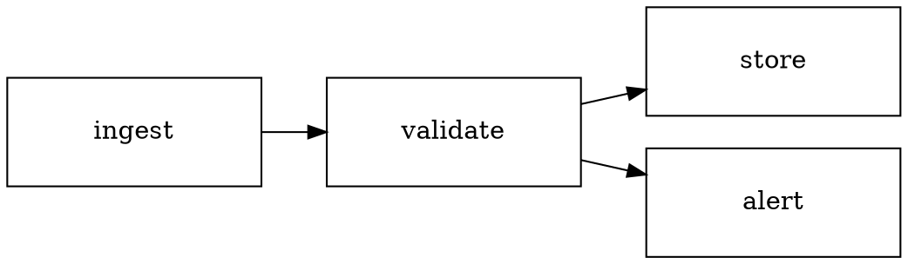
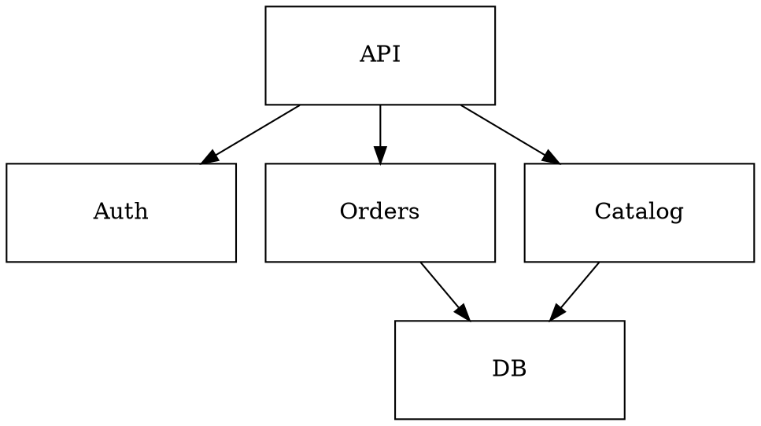

# Diagram layouts — three proven shapes

Each was built, validated (DL-*), and render-reviewed on a real machine
before being written here. The library is style-only; positions come from
`scripts/drawio_layout.py` (graphviz `dot`) or a hand grid. Import:

```python
import sys, json, subprocess
sys.path.insert(0, "<plugin>/scripts")
import drawio_lib as dl
```

Pick by topology. `from_layout()` turns `dot` positions into a styled
diagram in one call; the first node's out-edges become the accent primary
path.

## 1. Flow (linear or branching) — `dot` rankdir=LR

Write a `.dot`, lay it out, style it. Fixed box size keeps nodes uniform.


```python
layout = json.loads(subprocess.run(
    [sys.executable, "<plugin>/scripts/drawio_layout.py", "flow.dot"],
    capture_output=True, text=True).stdout)
labels = {"ingest": "Ingest", "validate": "Validate",
          "store": "Store", "alert": "Alert"}
d = dl.from_layout(layout, labels, dl.Diagram("pipeline"))
d.save(f"{OUT}/diagram.drawio", f"{OUT}/diagram.svg")
```

## 2. Tree / service hierarchy — `dot` rankdir=TB

Same call, `rankdir=TB` in the `.dot`. Good for org/service/decision trees.
`from_layout` colors the root's out-edges as the accent primary path (the
root is the node with no incoming edges); pass `primary_src="id"` to override.



### Boundary around a dot-laid-out graph — `zone_around`

`from_layout` places nodes but adds no boundary. To frame a subset with a
dashed zone (a VPC, a security perimeter) after layout, use `zone_around`,
which computes the box from the placed nodes (with label padding):

```python
d = dl.from_layout(layout, labels, dl.Diagram("arch"))
d.zone_around("vpc", "Private VPC", ["auth", "orders", "db"])  # frames those 3
d.save(f"{OUT}/diagram.drawio", f"{OUT}/diagram.svg")
```

## 3. Hand grid (no `dot`) + zones

When `dot` is absent (`drawio_layout.py` exits 1) or the layout is a simple
fixed arrangement, place nodes directly on the 8px grid and frame groups
with a dashed `zone()`:

```python
d = dl.Diagram("arch")
d.node("web", "Web", 40, 80)
d.node("api", "API", 240, 80, accent=True)
d.node("db", "Postgres", 440, 40)
d.node("cache", "Redis", 440, 128)
d.zone("data", "Data tier", 420, 8, 180, 200, dashed=True)  # frames db+cache
d.edge("web", "api", primary=True)
d.edge("api", "db"); d.edge("api", "cache")
d.save(f"{OUT}/diagram.drawio", f"{OUT}/diagram.svg")
```

Keep node x/y/w/h multiples of 8 (DL-6). Default box is 136×56.

## Notes

- `node(accent=False)` for secondary nodes (border stroke instead of
  accent); `edge(primary=True)` colors the main path accent — one accent
  path per diagram (DL-3).
- Labels ≤3 words (DL-2). Need a longer name? Shorten it or use a zone label.
- More than ~12 nodes (DL-1)? Split into two linked diagrams.
- Need a shape the library doesn't have? Add it to `drawio_lib.py`, prove it
  (build → `validate_drawio.py` → render → look), then document it — never
  author raw mxGraphModel XML in a one-off script.
